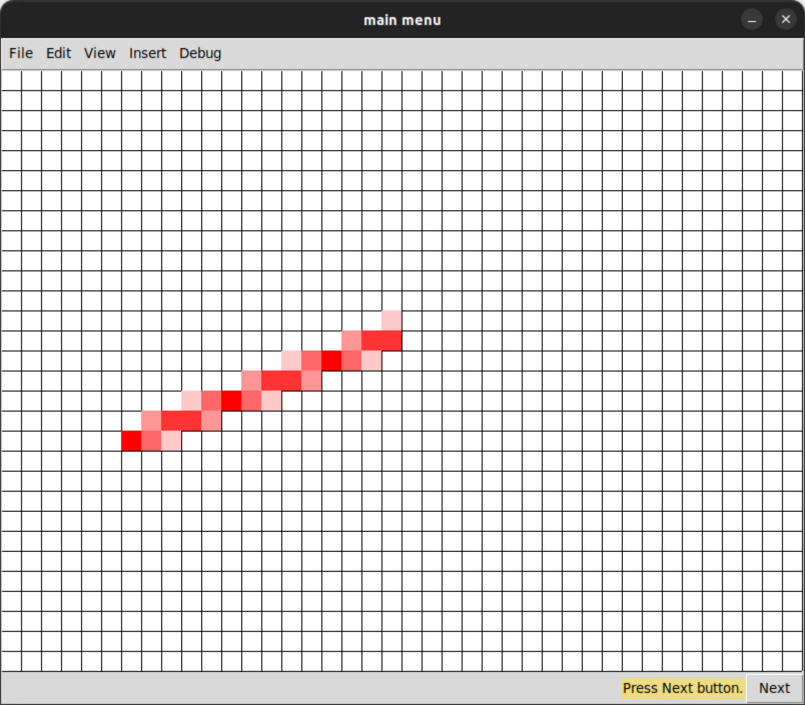

# Лабораторная работа №1 по дисциплине "Грфический Интерфейс Интеллктуальных Систем"  
**Тема:** алгоритмы построения отрезков.

**Выполнил:** Глёза Егор Дмитриевич.

## Цель работы
Разработка элементарного графического редактора с реализацией алгоритмов построения отрезков:
- **Цифровой дифференциальный анализатор (ЦДА)**
- **Целочисленный алгоритм Брезенхема**
- **Алгоритм Ву с сглаживанием**

Программа включает отладочный режим для пошагового отображения процесса генерации отрезков на дискретной сетке.

---

## Реализованные функции
1. **Генерация отрезков**  
   - Выбор алгоритма через меню "Вставка → Отрезки"
   - Указание начальной и конечной точек кликами мыши
   - Визуализация пикселей на холсте

2. **Отладочный режим**  
   - Пошаговое выполнение алгоритмов
   - Отображение текущего состояния сетки
   - Кнопка "Next" для перехода к следующему шагу

3. **Настройки**  
   - Размеры холста: 600×800 пикселей (настраивается в `config.py`)
   - Цвет по умолчанию: `#fff000` (красный)

---

## Описание алгоритмов

### 1. Цифровой дифференциальный анализатор (ЦДА)
**Принцип работы:**  
- Вычисление приращений `Δx` и `Δy`
- Определение шага по основной оси
- Линейная интерполяция координат с округлением

**Формулы:**  
```python
Δx = x2 - x1
Δy = y2 - y1
step = max(abs(Δx), abs(Δy))
x = x1 + 0.5 * sign(Δx)
y = y1 + 0.5 * sign(Δy)
```

### 2. Алгоритм Брезенхема
**Особенности:**  
- Использует только целочисленную арифметику
- Минимизация вычислений за счёт инкрементного обновления ошибки

**Ключевые шаги:**  
1. Инициализация ошибки: error = 2Δy - Δx
2. Выбор следующего пикселя:
   - Если error ≥ 0: движение по второстепенной оси
   - Иначе: движение по главной оси
3. Корректировка ошибки:
   error += 2Δy (при движении по главной оси)
   error += 2(Δy - Δx) (при движении по второстепенной оси)

### 3. Алгоритм Ву
**Преимущества:**  
- Сглаживание линий за счёт использования антиалиасинга
- Расчёт интенсивности цвета для промежуточных пикселей

**Реализация:**  
1. Вычисление расстояния до идеальной линии
2. Интерполяция цветов соседних пикселей:
   - Использование дробной части ошибки для определения интенсивности
   - Установка двух пикселей с разной прозрачностью

---

## Структура проекта
```
.
├── src/
│   ├── model/          # Модели алгоритмов
│   │   ├── line_dda_drawer.py
│   │   ├── line_bresenham_drawer.py
│   │   └── line_wu_drawer.py
│   ├── presenter/      # Логика приложения
│   │   └── main_presenter.py
│   ├── view/           # Интерфейс
│   │   └── main_window.py
│   └── config.py       # Настройки
├── main.py             # Точка входа
└── pyproject.toml      # Зависимости
```

---

## Инструкция по использованию
1. **Запуск программы**  
'''bash
poetry install
poetry run python main.py
'''

2. **Построение отрезка**  
   - Выберите алгоритм в меню "Вставка → Отрезки"
   - Укажите начальную и конечную точки на холсте

3. **Включение отладки**  
   - Отметьте пункт "Debug → Debug mode"
   - Нажимайте "Next" для пошагового выполнения

---

## Пример работы
**Отрезоки, построенные с помощью алгоритмов:**  


**Отладочный режим:**  


---

## Заключение
В ходе работы были реализованы три алгоритма генерации отрезков с учётом их особенностей:
- ЦДА: простота реализации, но низкая скорость из-за операций с плавающей точкой
- Брезенхем: максимальная производительность за счёт целочисленной арифметики
- Ву: высокое качество сглаживания, но повышенная сложность вычислений

Редактор демонстрирует базовые принципы работы графических алгоритмов и может быть расширен для поддержки других кривых (окружности, эллипсы и т.д.).